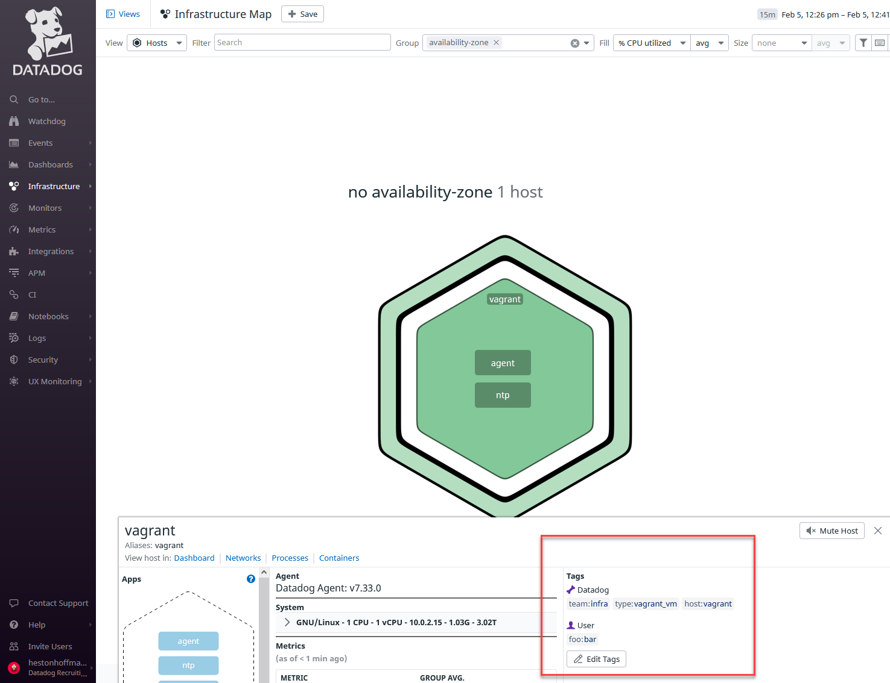
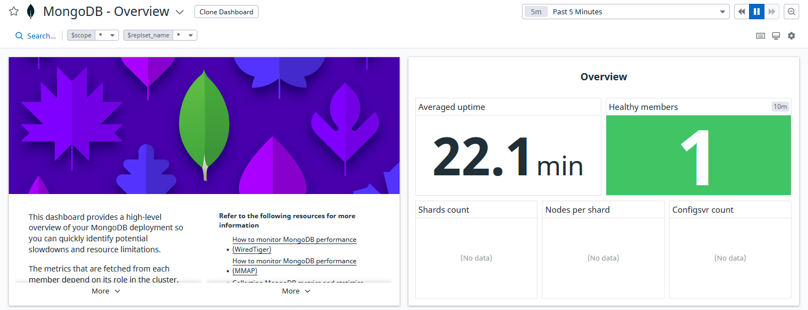
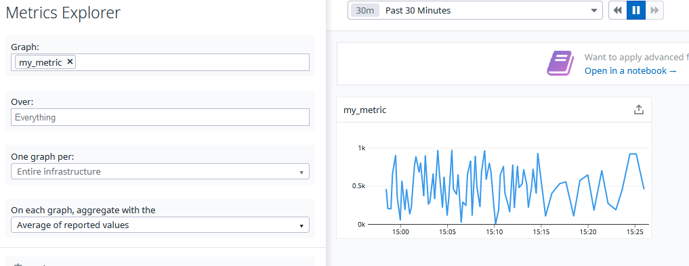
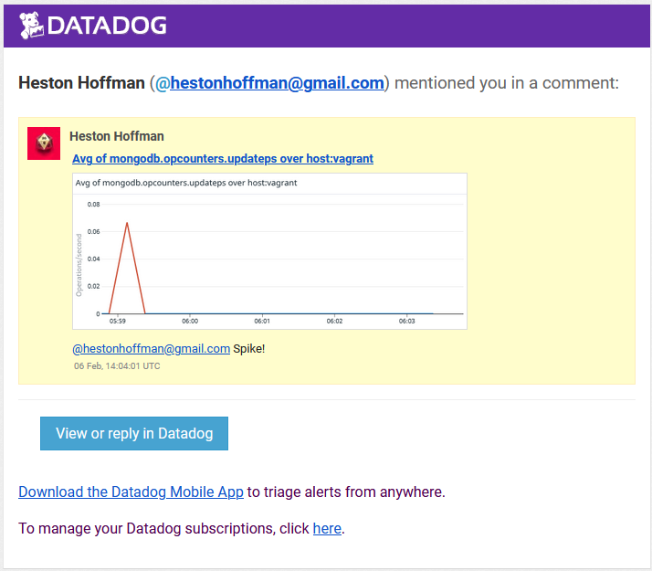
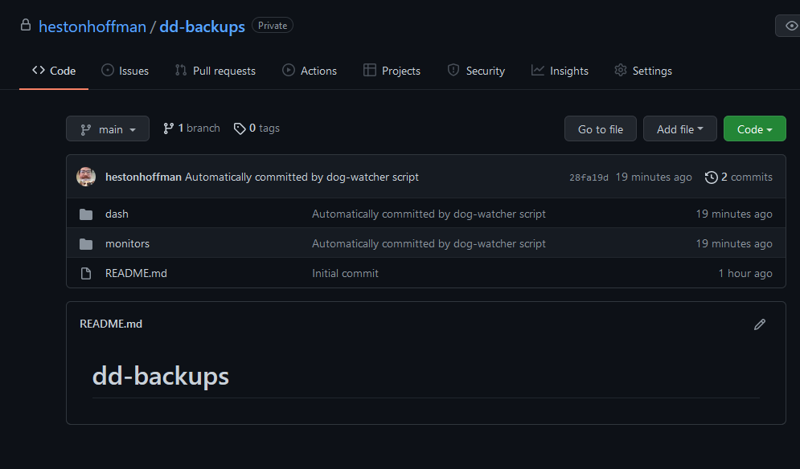

# Answers

I started a fresh Datadog trial and used Vagrant to set up an Ubuntu 18.04 VM.

## Exercise 1: Collecting metrics

I added the following tags to the agent config file at `/etc/datadog-agent/datadog.yaml`:

```yaml
tags: ["team:infra", "type:vagrant_vm"]
```

Here is a screenshot of the host and its tags:


I installed MongoDB and set up the Datadog integration for it. Here's the MongoDB configuration file at  
`/etc/datadog-agent/conf.d/mongo.d/conf.yaml`:

```yaml
init_config:

instances:
  - hosts:
      - 127.0.0.1
    username: datadog
    password: REDACTED
    database: admin
    options:
      authSource: admin
    logs:
      - type: file
        path: /var/log/mongodb/mongodb.log
        service: mongo
        source: mongodb
```

Here's a screenshot of the MongoDB integration dashboard:


---

I created a custom Agent check that submits a metric named `my_metric` with a random value between 0 and 1000 and set the collection interval to 45 seconds. Here is the config file at `/etc/datadog-agent/conf.d/my_metric.yaml`:

```yaml
init_config:

instances:
  - min_collection_interval: 45
```

Here is the Python check file at `/etc/datadog-agent/checks.d/my_metric.py`:
```python
# the following try/except block will make the custom check compatible with any Agent version
try:
    # first, try to import the base class from new versions of the Agent...
    from datadog_checks.base import AgentCheck
except ImportError:
    # ...if the above failed, the check is running in Agent version < 6.6.0
    from checks import AgentCheck

# content of the special variable __version__ will be shown in the Agent status page
__version__ = "1.0.0"

class RandomCheck(AgentCheck):
    def check(self, instance):
        import random
        self.gauge('my_metric', random.randint(0,1000), tags=['TAG_KEY:TAG_VALUE'] + self.instance.get('tags', []))
```

This screenshot from the **Metics** > **Explorer** view shows the collection interval changing from the default 15 seconds to the new 45 second interval:


**Bonus Question**: You can change the interval by modifying the YAML config file associated with the check. In this case, that's `my_metric.yaml`.

---

## Exercise 2: Visualizing data

This exercise was a little more difficult than the first one, but I had a lot of fun.

I created a dashboard with `my_metric` and an integration metric for MongoDB. I chose the "updates per second" metric (`mongodb.opcounters.updateps`) because it seemed quite active on the MongoDB dashboard.

[You can find the dashboard I created here](https://p.datadoghq.com/sb/59fff69a-86be-11ec-bfcd-da7ad0900002-b33aa88401b3fb9b6a48e5849a94a71e).

I don't have a lot of experience with Python and I decided that installing Ruby on my vagrant machine was probably overkill. I went with a Bash script and Curl command. I struggled with a couple things here:
- It took me a long time to figure out how to scope the metrics to my Vagrant host. It ended up being a syntax issue.
- I had to dig around in the docs a bit to find the available algorythms for the `anomalies()` function.

Creating a dashboard with the API requires an application key scoped to `dashboards_public_share`. I added the scope with this script: 

```bash
#! /bin/bash

# Path parameters
export app_key_id="REDACTED"

# Curl command
curl -X PATCH "https://api.datadoghq.com/api/v2/application_keys/${app_key_id}" \
-H "Content-Type: application/json" \
-H "DD-API-KEY: ${MY_DD_API_KEY}" \
-H "DD-APPLICATION-KEY: ${MY_DD_APP_KEY}" \
-d @- << EOF
{
  "data": {
    "attributes": {"scopes": "dashboards_public_share"},
    "id": "REDACTED",
    "type": "application_keys"
  }
}
EOF
```

Here is the Bash script that creates the dashboard:

```bash
#!/bin/bash

# Curl command
curl -X POST "https://api.datadoghq.com/api/v1/dashboard" \
-H "Content-Type: application/json" \
-H "DD-API-KEY: ${MY_DD_API_KEY}" \
-H "DD-APPLICATION-KEY: ${MY_DD_APP_KEY}" \
-d @- << EOF
{
    "layout_type": "ordered",
    "title": "my_metric and MongoDB anomaly",
    "widgets": [
      {
        "definition": {
          "requests": [
            {"q": "avg:my_metric{host:vagrant}"}
          ],
          "type": "timeseries"
        }
      },
      {
        "definition": {
          "requests": [
            {"q": "anomalies(avg:mongodb.opcounters.updateps{host:vagrant}, 'basic', 2)"}
          ],
          "type": "timeseries"
        }
      }
    ]
  }
EOF
```

It took me a while to figure out how to take a snapshot. Here's the email I got after taking the snapshot and tagging myself:



**Bonus Question**:
The anomaly graph adds a gray band over your metrics. If you notice a fluctuation in the metrics, you can use the overlaid band to determine whether a metric is still in an acceptable range based on past trends. Metrics that don't match the trend are anomalies. My anomaly graph doesn't seem to show the gray band. I think it might be because normal is 0. The spikes are showing up in red, indicating that they're anomalies.

---

## Final Exercise: Blog post

### Back up your Datadog dashboard and metrics with dog-watcher

As a Datadog user, you might have used JSON to programmatically generate your Datadog dashboards and monitors. Or, you might have exported a dashboard as JSON and shared it with a collaborator. But what if you could use JSON to track changes in your dashboards and monitors? Brightcove's [dog-watcher](https://github.com/brightcove/dog-watcher) backs up your dashboards to a GitHub repository, allowing you to track changes over time. Maybe you recently made changes to your dashboard and a metric is missing, or perhaps you want to restore a layout that you've used in the past? Read on to find out how to install and configure dog-watcher and start backing up your dashboards and monitors.

**Before you begin:**
- If you want to use dog-watcher's built-in scheduler, make sure you follow the steps below on a machine where you can guarantee high availability. Alternatively, configure the backup to run periodically using an automation tool like [Jenkins](https://www.jenkins.io/), or [CircleCI](https://circleci.com/).
- Set up a fresh GitHub repo for your Datadog backups.
- Install Node.js and NPM. We recommend using a version manager like [nvm](https://github.com/nvm-sh/nvm) or [nodist](https://github.com/nullivex/nodist).
- Make sure you've set up a [GitHub SSH key](https://docs.github.com/en/authentication/connecting-to-github-with-ssh) with write access to your repos.
- Make sure you have a [Datadog application key](https://docs.datadoghq.com/account_management/api-app-keys/#add-application-keys), and an [API key](https://docs.datadoghq.com/account_management/api-app-keys/#add-an-api-key-or-client-token).

**To set up dog-watcher:**
1. Clone the dog-watcher repo:

    ```shell
    git clone git@github.com:brightcove/dog-watcher.git
    ```

1. Create a file named `config.json` in the dog-watcher repo. 
1. Enter the following information in `config.json`, replacing the capitalized values with your application and API keys, and the name of your GitHub repo:

    ```json
    {
        "dataDogApiKey": "YOUR-DATADOG-API-KEY",
        "dataDogAppKey": "YOUR-DATADOG-APPLICATION-KEY",
        "gitRepoForBackups": "git@github.com:YOUR-GIT-ORG/YOUR-REPOSITORY-NAME.git",
        "gitBranchForBackups": "main",
        "sendEventOnNoop": "true",
        "noopEventMessage": "On noes! The backup failed!",
    }
    ```
1. Perform an initial backup to make sure dog-watcher is working:
    
    ```shell
    node index.js
    ```

    Your output should look something like this:
    
    ```shell
    $ node index.js
    [2022-02-06T10:39:17.051] [INFO] dog-watcher - Running a one-time backup.
    [2022-02-06T10:39:17.053] [INFO] dog-watcher - Performing a backup
    ```

    Take a look at your backup repo. You should see new `/dash` and `/monitors` directories containing your JSON backups: 
    
    

1. (Optional) If you want dog-watcher to run periodically, add a `backupInterval` key with a cron value to your `config.json`. For example, if you wanted the backup to run at midnight on Sundays:  
    ```json
    "backupInterval": "0 0 * * 0"
    ```
1. (Optional) After configuring a backup interval, run dog-watcher again with `node index.js`.

Congratulations! You've backed up your Datadog dashboards and monitors.

A big shout-out to [Brightcove](https://www.brightcove.com/en/) for creating dog-watcher! To find out more about how you can contribute to the Datadog community, check out our [community office hours](https://docs.datadoghq.com/developers/community/office_hours/).
